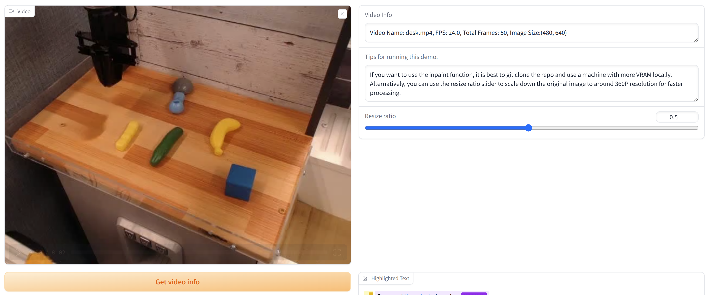
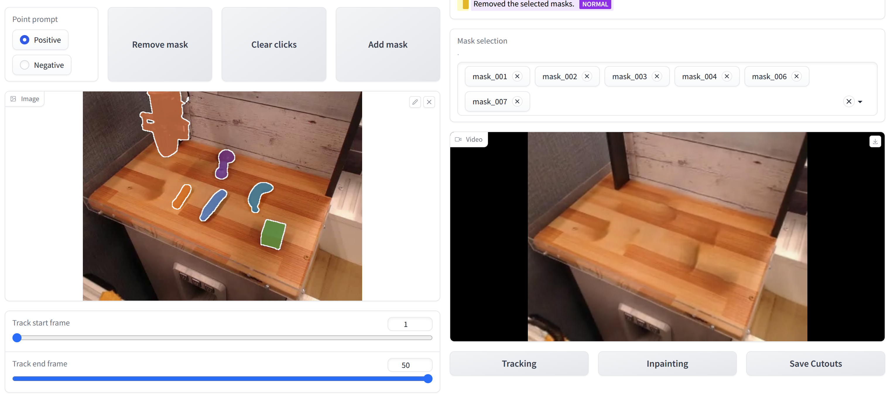
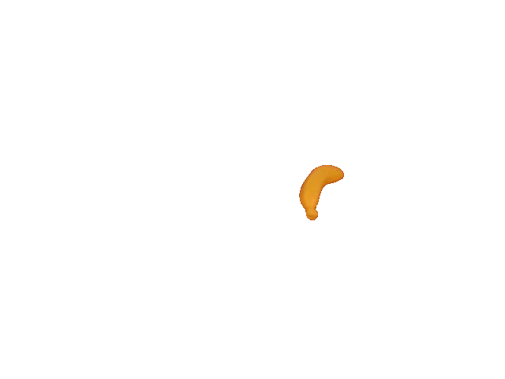
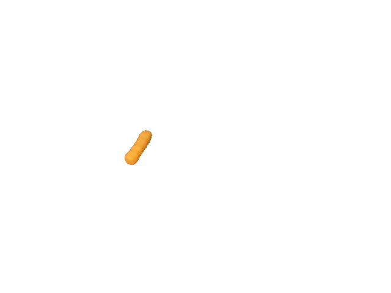
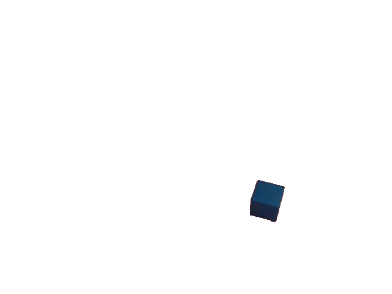
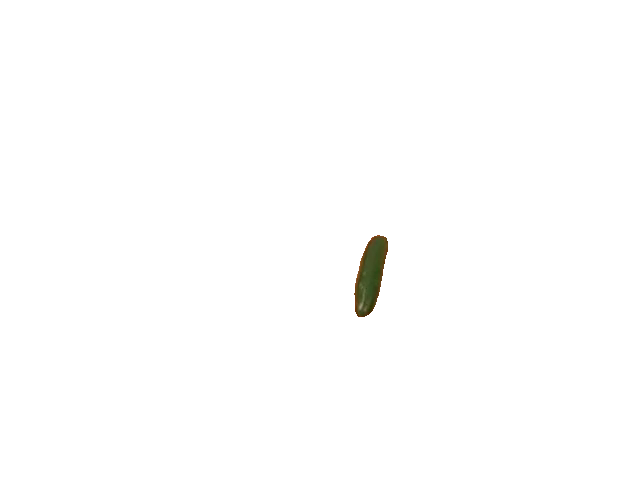
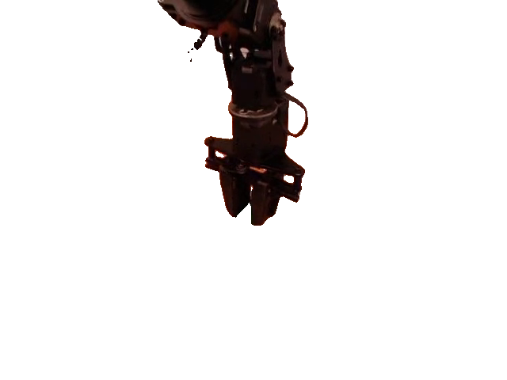
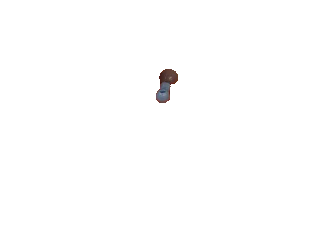
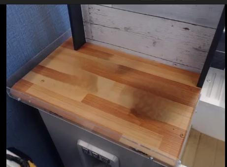

# Track-Anything Demo 使用说明（内部）

## 使用流程
1. 导入视频，点击 `Get video info` 读取帧信息。

2. 使用 `Positive` / `Negative` 点选目标，点 `Add mask` 添加一个物体；重复点选以添加多个物体。

3. 点击 `Tracking` 检查跟踪效果。
4. 点击 `Inpainting` 检查被 mask 掉后的效果。
5. 点击 `Save Cutouts` 保存抠图结果（输出目录：`./result/cutout/<视频名>/mask_###/00000.png`）。

## 示例输出
单独抠出的物体（6 个）：

| banana | chips | cube |
| --- | --- | --- |
|  |  |  |

| cucumber | robot | spoon |
| --- | --- | --- |
|  |  |  |

Mask 后的桌面：

